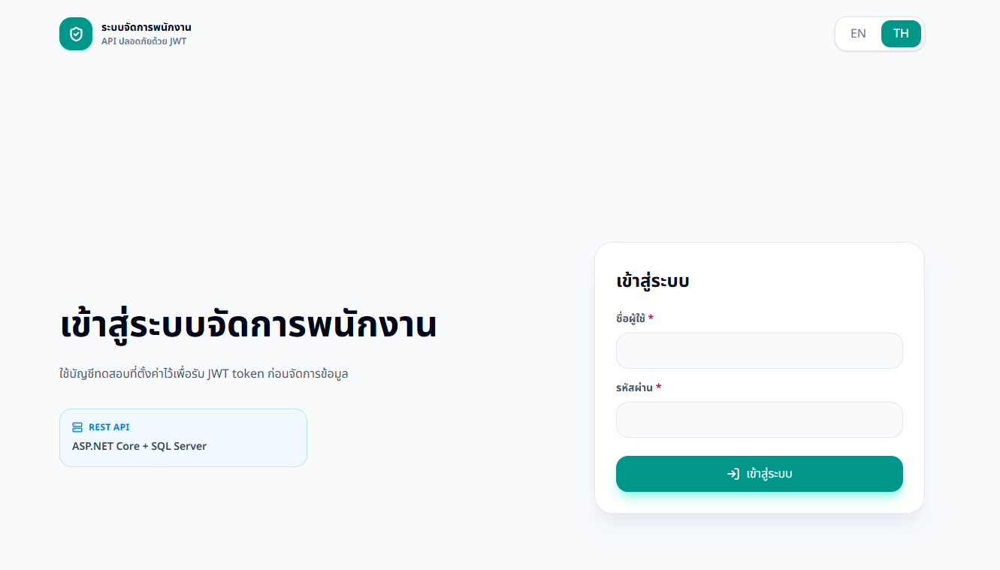

# Employee Management Test




โปรเจกต์ทดสอบระบบจัดการพนักงานแบบ Full-stack ระบบแยกเป็น Backend API, Frontend Web App และ SQL Server database script

## ภาพรวม

- จัดการข้อมูลแผนกและพนักงานแบบ CRUD
- Login ด้วย JWT ก่อนใช้งานระบบ
- แสดงชื่อแผนกในรายการพนักงาน
- อัปโหลดรูปพนักงาน `.jpg`, `.jpeg`, `.png`, `.webp`
- Pagination ทั้งฝั่ง API และหน้าเว็บ
- Frontend รองรับภาษาไทยและอังกฤษ
- ทดสอบ API ได้ผ่าน Swagger

## เอกสารแยกตามส่วน

- [Backend README](backend/README.md) - วิธีรัน API, ตั้งค่า SQL Server, endpoints, Swagger
- [Frontend README](frontend/README.md) - วิธีรัน Next.js, env config, pages, UI notes
- [Database Script](database/01_create_database.sql) - script สำหรับสร้าง database และ tables

## วิธีรันแบบสั้น

สร้าง database:

```powershell
sqlcmd -S localhost -E -i database\01_create_database.sql
```

รัน backend:

```powershell
cd backend
dotnet restore
dotnet run
```

รัน frontend ใน terminal อีกหน้าต่าง:

```powershell
cd frontend
npm.cmd install
Copy-Item .env.local.example .env.local
npm.cmd run dev
```

เปิดเว็บ:

```text
http://localhost:3000
```

Swagger:

```text
http://localhost:5000/swagger
```

## Login สำหรับทดสอบ

```text
Username: admin
Password: Admin@12345
```

## หมายเหตุ

- ใช้ database script แค่ `01_create_database.sql`
- สามารถเพิ่มข้อมูลทดสอบผ่านหน้าเว็บหรือ Swagger ได้โดยตรง
- รายละเอียดแต่ละฝั่งอยู่ใน README ของ `backend` และ `frontend`
